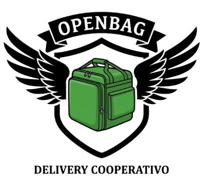
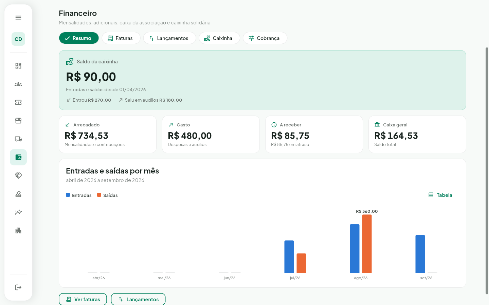
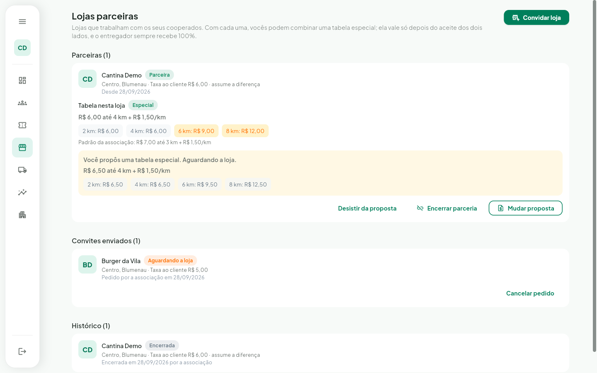

  

<h1 align="center">OpenBag</h1>

  <strong>Plataforma open source que dá visibilidade a pequenos negócios de comida e, quando possível, fortalece as cooperativas de entregadores da cidade.</strong>

  
  
  

  

> Esta documentação descreve a versão **0.2.0**. Veja o que mudou no [CHANGELOG](CHANGELOG.md).

---

## Nossa proposta

Muitos restaurantes, lanchonetes e cozinhas de bairro fazem comida boa e têm dificuldade de ser encontrados. O OpenBag dá a esses negócios uma **página própria**, um **cardápio online** e as ferramentas para **receber pedidos e controlar a operação** do dia a dia.

Ao mesmo tempo, queremos **ajudar as associações e cooperativas de entregadores** a organizar o trabalho, com ganho justo e rotas que economizam tempo e combustível.

### Duas formas de usar

| | Com uma associação ou cooperativa | Só o seu negócio |
|---|---|---|
| **Para quem** | Lojas que querem entregadores parceiros | Lojas que querem divulgar e se organizar |
| **O que você usa** | Página da loja, cardápio, pedidos, cozinha, caixa, rotas e chamada de entregadores da cooperativa | Página da loja, cardápio, pedidos, cozinha e caixa, com a sua própria equipe de entrega |
| **O que combinar** | Um **acordo com a associação ou cooperativa**: tabela de entrega, quem atende a loja e como fica o acerto | Nada. É só se cadastrar e montar a página |

> **Recomendamos o acordo com a associação ou cooperativa.** É ele que garante entregadores disponíveis e condições justas para os dois lados. Mesmo sem esse acordo, você pode usar o OpenBag **só para divulgar e controlar o seu negócio**.

### O que não negociamos

- **O entregador nunca ganha menos por causa de uma rota.** Quando pedidos saem juntos, ele recebe o valor cheio de cada entrega e roda menos.
- **A vitrine não vende posição.** A ordem das lojas não é um produto.
- **Os dados da loja são da loja.**
- **O código é aberto e auditável** (AGPL-3.0).

---

## Telas da versão 0.2.0

As capturas abaixo mostram o estado atual. Todas estão na pasta **[`layout/`](layout/)**.

### Sua loja, do seu jeito

O restaurante personaliza a própria página: **8 temas** (5 claros e 3 escuros) ou a **cor da marca**, além de imagem de destaque, logo e slogan. Tudo tem prévia ao vivo antes de salvar.

  

| Fresh Green | Midnight Blue | Berry Pink |
|---|---|---|
|  |  |  |

### Operação do restaurante

Pedidos em tempo real, tela da cozinha, comanda impressa, cardápio com complementos e combos, horários, rotas de entrega e caixa com o acerto de cada entregador.

| Rotas | Caixa |
|---|---|
|  |  |

### Cliente (em testes)

A vitrine, a página da loja, o carrinho, o checkout com pagamento na entrega e o acompanhamento do pedido já funcionam e estão **em fase de testes**.

| Vitrine | No celular |
|---|---|
|  |  |

### Entregador (em desenvolvimento)

O painel do entregador **está sendo construído**. Hoje ele já permite ficar online, receber ofertas em tempo real, seguir a rota, ver os ganhos e mostrar o perfil público com a placa QR.

  

### Associação e cooperativa (em testes)

O painel da associação tem cadastro com aprovação, gestão de membros, convites e tabela de entrega. Também tem:

- **Lojas parceiras.** A loja ou a associação pede a parceria, e ela só começa quando o outro lado aceita. Os dois lados podem encerrar.
- **Tabela especial por loja.** Com cada parceira, a associação e a loja podem combinar uma tabela própria, que só vale com o aceite dos dois. O entregador sempre recebe 100% do valor.
- **Relatórios.** O gestor vê as entregas e os ganhos por dia, por cooperado e por loja. Cada cooperado vê o resumo da associação e a parte dele, sem os ganhos dos colegas.
- **Financeiro.** A mensalidade pode ser um valor fixo ou um percentual dos ganhos até um teto. A associação também pode oferecer adicionais, como o seguro de vida (+10% na mensalidade), que cada cooperado aceita ou recusa. As faturas saem todo mês, o gestor registra o pagamento e o painel mostra o arrecadado, o gasto e o que falta receber.
- **Caixinha solidária.** Os cooperados contribuem com o valor que quiserem para ajudar um colega que passar por um problema. Todos veem o saldo, sem o nome de quem recebeu ajuda.
- **Convênios, enquetes e atas.** Descontos com oficinas, escolas e outros parceiros, enquetes com voto secreto e as atas das reuniões, tudo disponível para os cooperados no painel deles.
- **Taxa por distância.** A loja pode repassar a taxa ao cliente: ele paga pela distância, a vitrine mostra "a partir de" e o entregador recebe o valor inteiro.

  

  

---

## Como funciona

1. **A loja se cadastra** e monta a página e o cardápio.
2. **Se quiser, faz um acordo com uma associação ou cooperativa** de entregadores da região.
3. **O cliente pede** pela página da loja, no navegador ou no celular.
4. **A loja recebe o pedido na hora** e prepara na cozinha.
5. **A entrega sai** com um entregador da cooperativa, um entregador fixo da loja ou a equipe própria da loja.

---

## Versões e roadmap

Usamos [Versionamento Semântico](https://semver.org/lang/pt-BR/). Enquanto estivermos em `0.x`, cada etapa do roadmap é uma nova versão `MENOR`. As regras completas e o histórico estão no **[CHANGELOG](CHANGELOG.md)**.

| Versão | Etapa | Status |
|--------|-------|--------|
| 0.1.0 | MVP: cadastro, onboarding, carrinho, pedidos, mapas | Lançada |
| **0.2.0** | **Operação do restaurante, associações e personalização da loja** | **Atual** |
| 0.3.0 | Entregador, cooperativa e cliente | Em andamento |
| 0.4.0 | Segurança e integridade dos dados | Planejada |
| 0.5.0 | Auditoria de dados | Planejada |
| 1.0.0 | Primeira versão estável, com piloto real | Planejada |

**0.3.0: Entregador, cooperativa e cliente**
- [x] Concluir as telas do entregador
- [x] Painel da cooperativa: parcerias com lojas, acordos e relatórios
- [x] Gestão da associação: mensalidade, adicionais, caixinha, financeiro, convênios, enquetes e atas
- [x] Taxa de entrega repassada ao cliente ("a partir de") e contraproposta de tabela
- [ ] Fluxo do cliente fora da fase de testes, com avaliações
- [ ] Página da loja otimizada para buscadores e vitrine por avaliações e proximidade

**0.4.0: Segurança e integridade dos dados**
- [ ] Verificação de **race conditions** (ofertas, status do pedido, caixa)
- [ ] **Rate limiting** no login, no cadastro, nos pedidos e nos envios de arquivo
- [ ] **Throttling** de localização, de WebSocket e dos jobs agendados
- [ ] **Idempotência** em pedidos, aceite de oferta e acerto de caixa
- [ ] Integridade dos dados: migrações versionadas e restrições no banco
- [ ] Revisão de segurança (permissões, OWASP Top 10, segredos)

**0.5.0: Auditoria de dados**
- [ ] Trilha de auditoria (quem, o quê, quando, antes e depois)
- [ ] Histórico que não pode ser alterado para caixa e ganhos
- [ ] Relatórios exportáveis para a loja e para a cooperativa
- [ ] LGPD: exportação, exclusão e retenção de dados

---

## Para desenvolvedores

- **[Guia de desenvolvimento](README-DEVELOPER.md)**: setup, Docker, variáveis e testes.
- **[Arquitetura](docs/architecture/README.md)**: módulos, tempo real, despacho e rotas.
- **[API](docs/api/README.md)**: endpoints REST.
- **[Design system](frontend/lib/core/ui/README.md)**: componentes e temas do app.
- **[Layout](layout/)**: capturas de tela de referência.

Stack: **Java 25 + Spring Boot**, **Flutter** (web e mobile), **PostgreSQL**, **Redis**, **WebSocket/STOMP** e **OpenStreetMap**.

---

## Como contribuir

O OpenBag é **100% open source** e depende da comunidade. Dá para ajudar com código (Java, Flutter), design, testes, documentação ou divulgação, e também trazendo uma cooperativa ou um restaurante da sua cidade.

Leia o **[guia de contribuição](CONTRIBUTING.md)** para começar.

---

## Licença

Licenciado sob a **AGPL-3.0**. Veja o arquivo [LICENSE](LICENSE.md).

Você pode usar comercialmente, modificar e distribuir o OpenBag. Se você modificar o código e oferecer a plataforma como serviço na rede, precisa publicar o código-fonte das suas modificações. Assim o OpenBag continua aberto para todos.

---

## Contato

**Quer saber mais, usar o OpenBag na sua cidade ou trazer a sua cooperativa?**
Escreva para **[lucasramos.developer@gmail.com](mailto:lucasramos.developer@gmail.com)**.

- [Discussões no GitHub](https://github.com/LucasRamos-Developer/openbag/discussions)
- [Issues no GitHub](https://github.com/LucasRamos-Developer/openbag/issues)
- [Site do projeto](https://lucasramos-developer.github.io/openbag/)

**Desenvolvedor principal:** Lucas Ramos

> "OpenBag" é um nome provisório. Sugestões são bem-vindas.

---

  <a href="CHANGELOG.md">Changelog</a> ·
  <a href="docs/architecture/README.md">Arquitetura</a> ·
  <a href="README-DEVELOPER.md">Desenvolvimento</a> ·
  <a href="CONTRIBUTING.md">Contribuir</a> ·
  <a href="layout/">Layout</a>

