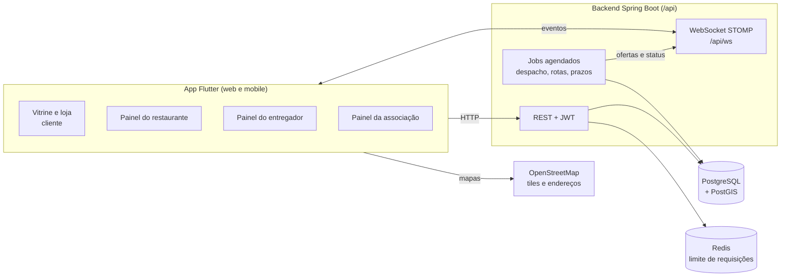
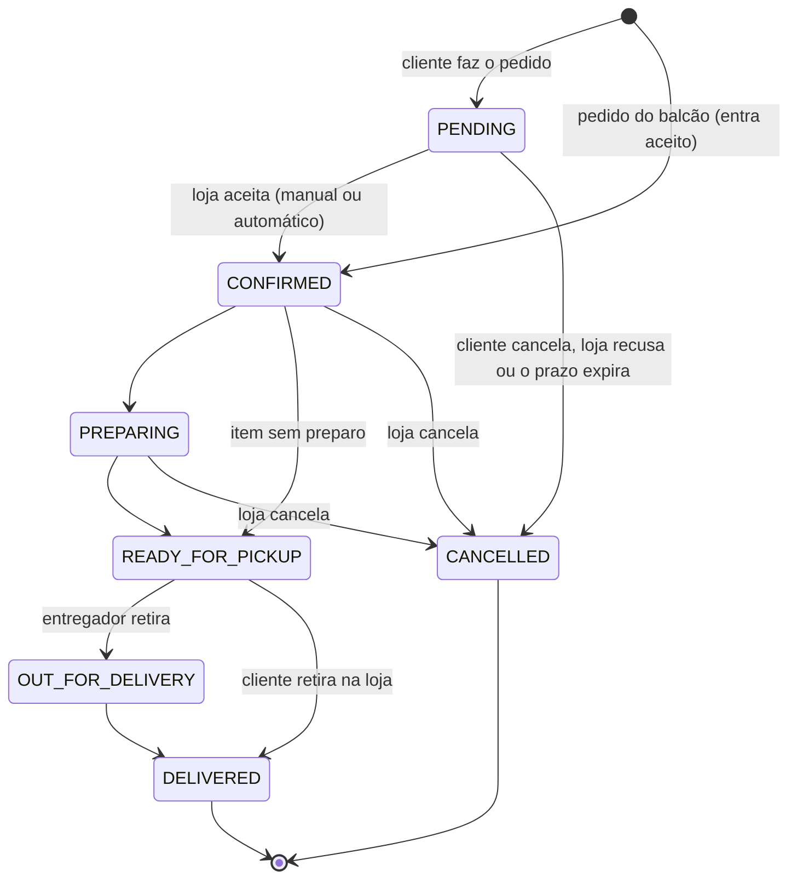
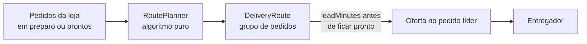

# Arquitetura do OpenBag

> Versão da documentação: **0.3.0**, com as mudanças da 0.4.0 (prontas e ainda não lançadas), atualizada em 2026-09-29. O que mudou está no [CHANGELOG](../../CHANGELOG.md).

Este documento explica como o sistema está organizado hoje: módulos do backend, tempo real, segurança, despacho de entregas, rotas, caixa, dados e a estrutura do app Flutter. Para rodar o projeto, veja o [guia de desenvolvimento](../../README-DEVELOPER.md).

---

## Visão geral



| Camada | Tecnologia |
|--------|------------|
| App | Flutter 3.16+ (web e mobile), Provider, GoRouter, `flutter_map`, `stomp_dart_client` |
| API | Java 25, Spring Boot 3.5, Spring Security + JWT, Spring Data JPA, SpringDoc, Bucket4j, ShedLock |
| Tempo real | WebSocket com STOMP (broker simples do Spring) |
| Banco | PostgreSQL 15 com PostGIS 3 (caminho das rotas), esquema versionado com Flyway |
| Cache e limites | Redis: contadores do limite de requisições. Sem Redis, cada instância conta sozinha. |
| Infra local | Docker Compose: PostgreSQL com PostGIS, Redis, Elasticsearch e Kibana |
| CI | GitHub Actions: testes do backend (Testcontainers) e do app a cada push, Dependency-Check semanal e Dependabot |

O Elasticsearch continua no `docker-compose.yml` para a busca que virá, mas o código ainda não o usa.

---

## Backend

O código fica em `backend/src/main/java/com/openbag` e é **organizado por domínio e, dentro dele, por funcionalidade**: `com.openbag.<domínio>.<funcionalidade>.<camada>`. As camadas são `controller`, `dto`, `entity`, `repository` e `service` (só as que a funcionalidade usa). Cada enum fica em `entity/` da funcionalidade dona dela.

```
com/openbag/
├── platform/          # Infraestrutura, sem regra de negócio
│   ├── config/        #   Redis, Elasticsearch, OpenAPI, agendamento, segredos de produção
│   ├── security/      #   SecurityConfig, JWT, UserDetails, AuthorizationService, @IsRestaurantOwner e @IsAssociationManager
│   ├── web/           #   GlobalExceptionHandler e exceções (400, 404, 409...), idempotência, limite de requisições, health
│   ├── realtime/      #   WebSocket/STOMP (autenticação e sessões)
│   ├── files/         #   Arquivos enviados
│   ├── geo/           #   Geocodificação e distâncias
│   ├── util/          #   CPF/CNPJ, CSV, conversores
│   └── seed/          #   Papéis iniciais e dados de demonstração
├── account/           # Cadastro, login, perfil, papéis, endereços
├── restaurant/
│   ├── store/         #   Loja (horários, pausa, aparência), página pública, onboarding
│   ├── catalog/       #   Produtos, categorias, complementos, catálogo global
│   ├── menu/          #   Seções e itens do cardápio do dono
│   ├── combo/         #   Combos
│   └── cash/          #   Caixa da loja e acerto com os entregadores
├── order/
│   ├── core/          #   Pedidos do cliente e do balcão, gestão pela loja
│   ├── realtime/      #   Eventos de pedido e de localização enviados por WebSocket
│   └── review/        #   Avaliações da loja e do entregador
├── delivery/
│   ├── courier/       #   Perfil, veículos, turno, ganhos e rastreio do entregador
│   ├── dispatch/      #   Despacho, ofertas, frete e configurações de entrega da loja
│   ├── route/         #   Rotas com mais de um pedido
│   └── link/          #   Vínculo loja-entregador e equipe própria
├── association/
│   ├── core/          #   Associações e cooperativas, membros, convites, tabela de entrega
│   ├── finance/       #   Mensalidade, adicionais, faturas, livro-caixa, caixinha
│   ├── community/     #   Convênios, enquetes, atas e documentos
│   ├── member/        #   O que o cooperado vê em /me/association
│   └── partnership/   #   Parcerias com as lojas (tabela especial) e relatórios
└── admin/             # Painel da plataforma (só leitura)
```

### Módulos e rotas principais

Todas as rotas ficam sob o prefixo `/api`. A lista completa está no Swagger: `http://localhost:8080/api/swagger-ui.html`.

| Pacote | Rotas base | O que faz |
|--------|------------|-----------|
| `account` | `/auth`, `/users` | Cadastro (cliente, restaurante, entregador, associação), login JWT, perfil e endereços |
| `restaurant.store` | `/restaurants`, `/public/restaurants` | Dados da loja, aparência (tema, logo, destaque), endereço, horários, abrir, fechar e pausar; página pública por `slug` |
| `restaurant.catalog` | `/products`, `/customizations`, `/public/categories`, `/global-products` | Produtos, grupos de complementos, categorias |
| `restaurant.menu` | `/restaurants/{id}/menu` | Seções (com ícone) e itens do cardápio, disponibilidade |
| `restaurant.combo` | `/combos` | Combos da loja |
| `restaurant.cash` | `/restaurants/{id}/cash` | Caixa da loja e acerto com os entregadores |
| `order.core` | `/orders`, `/restaurants/{id}/orders` | Checkout do cliente, pedido do balcão e ciclo do pedido na loja (aceitar, preparar, pronto, despachar, entregar) |
| `order.review` | `/orders/{id}/review`, `/restaurants/{id}/reviews` | Avaliações e respostas da loja |
| `delivery.courier` | `/me/courier`, `/me/courier/work`, `/public/couriers` | Perfil e veículos do entregador, turno, ofertas e ganhos |
| `delivery.dispatch` | `/restaurants/{id}/delivery` | Configurações de entrega da loja, entregadores disponíveis e despacho |
| `delivery.route` | `/restaurants/{id}/routes` | Rotas da loja |
| `association.core` | `/associations`, `/public/associations`, `/admin/associations` | Associações: cadastro, aprovação, membros, convites e tabela de entrega |
| `association.finance` | `/associations/{id}/fee-policy`, `/addon-plans`, `/invoices`, `/ledger`, `/finance/summary` | Cobrança da mensalidade (fixa ou percentual com teto), adicionais, faturas com baixa manual, livro-caixa e caixinha solidária |
| `association.community` | `/associations/{id}/benefits`, `/polls`, `/documents` | Convênios, enquetes e atas |
| `association.member` | `/me/association` | Área do cooperado: vínculo, resumo (`/report`), faturas, adicionais, caixinha, convênios, enquetes e documentos |
| `association.partnership` | `/associations/{id}/partnerships`, `/associations/{id}/reports` | Parcerias entre loja e associação (com tabela especial) e relatórios da associação |
| `admin` | `/admin/**` | Números da plataforma e moderação de associações |
| `platform` | `/files`, `/health` | Imagens enviadas (só leitura: cada upload é feito pela rota do próprio recurso), health check, filtros de idempotência e de limite |

### Papéis

Papéis (`Role`): `CUSTOMER`, `RESTAURANT_OWNER`, `DELIVERY_PERSON`, `ASSOCIATION_MANAGER` e `ADMIN`. Um mesmo usuário pode ter mais de um painel, e o app mostra um seletor de perfil no menu. O antigo `UserType` só existe por compatibilidade e não dá permissão nenhuma. O dono do recurso ("é dono deste restaurante", "gerencia esta associação") é conferido pelo `AuthorizationService`, com as anotações `@IsRestaurantOwner` e `@IsAssociationManager` e com consultas limitadas ao dono (`findByIdAndRestaurantId`...).

---

## Ciclo do pedido



- **Transições:** todas as mudanças de status passam por `OrderStatus.canTransitionTo`. Cada ação ainda restringe a origem, por exemplo "o cliente só cancela antes do aceite".

- **Preço calculado no servidor:** o `OrderCalculator` recalcula itens e complementos, e o valor enviado pelo app não é usado.
- **Código do dia:** cada pedido recebe um `#0001` que reinicia a cada dia.
- **Aceite:** cada loja configura o aceite como `MANUAL` (com prazo, `acceptDeadline`) ou `AUTO`. Um job cancela os pedidos que passam do prazo.
- **Pagamento:** na entrega (`Order.PaymentMethod`: dinheiro com troco, cartão, Pix ou vale-refeição).
- **Horário:** `Restaurant.isOpenNow` usa o fuso `America/Sao_Paulo`.

---

## Tempo real (WebSocket/STOMP)

Endpoint: `/api/ws`. O `StompAuthInterceptor` valida o JWT no `CONNECT` e verifica se o usuário pode assinar cada tópico.

| Tópico | Quem assina | Conteúdo |
|--------|-------------|----------|
| `/topic/restaurants/{id}/orders` | Gestor de pedidos e tela da cozinha | Pedido criado ou alterado |
| `/topic/orders/{id}` | Cliente dono do pedido | Mudanças de status |
| `/topic/couriers/{id}` | O próprio entregador | Ofertas, atribuições, rotas |

Os eventos só saem **depois do commit** da transação (`OrderEventPublisher` e `CourierNotifier`). Assim, ninguém recebe um estado que acabou desfeito.

- **Limites da sessão:** mensagem de até 8 KB (os clientes só conectam e se inscrevem), buffer de envio de 512 KB e 15 s de tempo de envio. Um cliente lento é desconectado.
- **Validade:** a sessão vale até o token do `CONNECT` vencer. Depois disso, o `StompSessionRegistry` fecha a sessão, e o app reconecta com o token atual.
- **Origens:** as mesmas do CORS (`app.cors.allowed-origins`).

---

## Segurança

| Proteção | Onde |
|---|---|
| **Segredos de produção:** o perfil `prod` (padrão da imagem Docker) não tem valores padrão. O backend não sobe sem as variáveis e recusa segredos de desenvolvimento e a conta demo. | `ProductionEnvironmentCheck`, `SecretsValidator`, `application-prod.properties` |
| **Cadastro:** o público sempre cria um cliente, e o papel nunca vem do corpo da requisição. | `AuthController`, `AccountService` |
| **Uploads:** o tipo da imagem é detectado pelos bytes, a extensão vem desse tipo e a pasta fica presa ao diretório. `/files` só serve imagens, com CSP `sandbox`. | `FileStorageService`, `FileController` |
| **CORS e WebSocket:** só as origens configuradas. | `SecurityConfig`, `WebSocketConfig` |
| **Conta desativada:** perde o acesso na hora, na API e no WebSocket. | `JwtAuthenticationFilter`, `StompAuthInterceptor` |
| **Limite de requisições:** login (por IP e por email), cadastros, consulta de email, cotações, pedidos e uploads, com 429 e `Retry-After`. | `RateLimitFilter`, `RateLimiter` (Bucket4j no Redis) |
| **Idempotência:** a mesma escrita com a mesma `Idempotency-Key` não é aplicada duas vezes. | `IdempotencyFilter` (veja [Idempotência](#idempotência)) |
| **Erros:** as respostas não trazem detalhes internos, e o log fica em INFO, sem SQL, fora do perfil `local`. | `GlobalExceptionHandler` |

Ordem dos filtros no Spring Security: JWT → limite de requisições → idempotência. O checklist do OWASP Top 10 está no [roadmap da 0.4.0](../roadmap/0.4.0-seguranca.md#checklist-owasp-top-10-2021).

---

## Despacho de entregas

O despacho fica em `delivery/dispatch`.

### Com quem a loja trabalha

Cada loja escolhe uma política (`CourierPolicy`):

| Política | Significado |
|----------|-------------|
| `OPEN` | Qualquer entregador online perto da loja |
| `PARTNERS_ONLY` | Só entregadores de associações parceiras da loja |
| `FIXED_ONLY` | Só entregadores fixos da loja, com os livres como reserva se a loja quiser (`fallbackToOpen`) |

### Tipos de entregador

- **Livre:** fica online e envia a localização. A oferta vai para quem tem a melhor nota no `CourierSelector`, que combina **distância** e **justiça** (quem ganhou menos no dia tem prioridade). Os pesos ficam em `app.delivery.weight-*`. A oferta expira depois de `offer-timeout-s` (30 s) e passa ao próximo. O raio de busca é `search-radius-km` (6 km).
- **Fixo:** o vínculo com a loja é aprovado pelo dono. O entregador faz check-in a até `checkin-radius-m` (300 m) da loja e, durante o turno, só atende aquela loja.
- **Equipe própria (`StaffCourier`):** entregadores da loja que não usam o app. A loja atribui o pedido diretamente.

### Atribuição direta e troca

A loja pode escolher o entregador sem que ele precise aceitar uma oferta. As regras de troca ficam no `ReassignPolicy`:
- entregador fixo ou da equipe própria: pode ser trocado a qualquer momento antes da retirada;
- entregador livre: só pode ser trocado se não aparecer em `Restaurant.courierNoShowMinutes` (padrão de 10 min) e não estiver a menos de 200 m da loja.

### Valor da entrega

A **tabela da associação** define um valor base até X km e um valor por km extra. O entregador recebe 100% desse valor. O cálculo fica no `DeliveryRateCalculator`.

---

## Rotas



- O `RoutePlanner` é um algoritmo puro, sem banco nem Spring, e por isso é fácil de testar. Ele agrupa pedidos da mesma direção ou bairro quando isso economiza distância.
- O `RoutePlanningService` roda a cada 10 s (`app.delivery.route-planning-ms`) e grava os grupos como `DeliveryRoute`.
- O entregador é chamado `leadMinutes` antes de o último pedido do grupo ficar pronto. Nenhum pedido sai antes de `dispatchReleasedAt`.
- A loja vê e ajusta as rotas em `/restaurante/rotas`: junta, separa e escolhe o entregador.
- O caminho pelas ruas vem do OSRM (`StreetRoutingService`) e fica salvo na rota (`street_path`, uma `LineString` do PostGIS), junto com as paradas usadas no cálculo (`street_path_key`). O painel só pede um caminho novo quando as paradas mudam. Sem resposta do OSRM, o mapa desenha linha reta.

**Duas regras fixas, travadas por testes:**
1. **O ganho do entregador nunca cai por causa da rota.** A oferta de rota paga a soma do valor cheio de cada entrega (teste `routeOfferPaysTheFullTableValueOfEveryDelivery`).
2. **O cliente nunca sabe que o pedido está esperando outro.** Ele recebe `OrderDTO.forCustomer`, sem o tipo de entregador nem os prazos internos, e o histórico usa mensagens neutras.

---

## Caixa

Em `/restaurante/caixa` (`CashReportService` e `CourierSettlement`):
- nas entregas pagas em dinheiro, o dinheiro fica com o entregador;
- o saldo de cada entregador é **dinheiro recebido − ganhos das entregas**;
- a loja registra o acerto, e o acerto fica no histórico.

---

## Jobs agendados

O agendamento fica no `SchedulingConfig`, com um agendador próprio (`jobs-*`, 4 threads, `app.jobs.pool-size`).

| Job | Intervalo padrão | Propriedade | Trava (ShedLock) |
|-----|------------------|-------------|------------------|
| Expirar pedidos sem aceite | 30 s | `app.orders.expiration-check-ms` | `orders.expireUnanswered` |
| Expirar ofertas e passar ao próximo | 5 s | `app.delivery.offer-check-ms` | `dispatch.expireOffers` |
| Tentar de novo pedidos sem entregador | 15 s | `app.delivery.retry-ms` | `dispatch.retryWaitingOrders` |
| Encerrar turnos livres sem sinal | 60 s | `app.delivery.stale-shift-check-ms` | `dispatch.closeStaleShifts` |
| Planejar rotas | 10 s | `app.delivery.route-planning-ms` | `dispatch.planRoutes` |
| Gerar as faturas do mês | dia 1, às 3h | `app.cooperative.invoice-cron` | `cooperative.generateInvoices` |
| Apagar chaves de idempotência vencidas | 1 h | `app.idempotency.cleanup-ms` | `idempotency.deleteExpired` |
| Fechar WebSocket com token vencido | 1 min | `app.websocket.expiry-check-ms` | não (cada instância cuida das suas sessões) |

Com várias instâncias do backend, cada job com trava roda em uma instância por vez: a trava fica na tabela `shedlock` e usa o relógio do banco. O atraso da primeira execução de cada job também é configurável (`*-initial-delay-ms`); os testes o usam para desligar os jobs.

> O broker do WebSocket ainda é o simples, em memória: com várias instâncias, um cliente só recebe as mensagens da instância em que está conectado. Um broker externo fica para depois da 0.4.0.

---

## Dados

- O esquema vem das migrações do Flyway (`backend/src/main/resources/db/migration`). O Hibernate só confere se as entidades batem com o banco (`ddl-auto=validate`).
- Toda mudança de entidade vira uma migração nova, inclusive valores novos de enum (o `CHECK` da coluna é recriado).
- Bancos criados antes do Flyway entram com *baseline* na V1, que tem o mesmo esquema e os mesmos nomes de restrições do antigo `ddl-auto=update`.
- O banco precisa do PostGIS: a V1 cria a extensão.

### Ações simultâneas

O mesmo pedido pode ser mexido ao mesmo tempo pela loja, pelo entregador, pelo cliente e pelos jobs. As regras abaixo evitam que uma ação desfaça a outra:

- **Quem muda um pedido trava o pedido** (`OrderRepository.findByIdForUpdate`): etapas da loja, cancelamento do cliente, aceite do entregador, retirada, entrega e jobs.
- **Ordem das travas: pedido antes do entregador.** Quem trava mais de um pedido usa `findAllByIdForUpdate`, que trava em ordem de id. Com o líder de uma rota travado, não se trava outro pedido: pede-se o despacho da rota por evento (`DispatchRequestedEvent`).
- **Trava otimista** (`@Version`) em `Order`, `DeliveryPerson`, `DeliveryOffer`, `DeliveryRoute` e `MemberInvoice`: uma gravação feita a partir de uma leitura antiga falha em vez de sobrescrever.
- **A posição do entregador é gravada à parte** (`DeliveryPersonRepository.updateLocation`), sem salvar a entidade inteira, e o `DeliveryPerson` usa `@DynamicUpdate`.
- **Conflito vira 409.** No trabalho de fundo (eventos do despacho, jobs e planejador de rotas), `DispatchService.withRetry` tenta de novo até 3 vezes.
- **O banco confere as regras de "um aberto por vez"**: uma oferta pendente por pedido e por entregador, um turno aberto e um vínculo aberto por entregador. São restrições de exclusão adiadas para o commit, porque o Hibernate insere o registro novo antes de atualizar o antigo.
- **As mudanças de status passam por `OrderStatus.canTransitionTo`.**
- O teste `ConcurrentActionsTest` reproduz cada corrida com duas threads contra o banco de verdade.

### Idempotência

- **Chave de idempotência.** Uma escrita com o cabeçalho `Idempotency-Key` fica registrada em `idempotency_keys` (`IdempotencyFilter`, na cadeia do Spring Security, depois do JWT). Repetida com a mesma chave e o mesmo corpo, ela recebe a resposta guardada, e a ação não roda de novo.
- **Quando a chave é liberada.** Erro do servidor, 409 e 429 liberam a chave, para que a ação possa ser tentada de novo.
- **No app.** Cada ação que cria algo ou mexe com dinheiro usa um `IdempotencyKey`, e o `ApiClient` tenta de novo sozinho quando a rede falha. Uma ação nova desse tipo deve seguir o mesmo padrão.

---

## Frontend (Flutter)

```
frontend/lib/
├── main.dart            # Rotas (GoRouter) e providers
├── core/ui/             # Design system: componentes App*, temas e tokens
├── models/              # Modelos por domínio (order, menu, delivery, routes, cash...)
├── services/            # Chamadas à API e ao WebSocket
├── screens/             # Telas por área: restaurant_panel, courier, association...
├── widgets/             # Widgets reutilizáveis por domínio (menu, order, delivery...)
└── utils/               # Formatadores, mapas, localização
```

### Rotas do app

| Rota | Tela | Status |
|------|------|--------|
| `/home` | Vitrine de restaurantes (a raiz `/` leva o visitante para cá) | Pronto |
| `/r/:slug` | Página da loja com o tema dela | Pronto |
| `/cart`, `/checkout` | Carrinho e checkout | Pronto |
| `/pedidos`, `/pedidos/:id` | Meus pedidos, acompanhamento e avaliação | Pronto |
| `/restaurante/*` | Painel do restaurante (pedidos, cardápio, entregadores, rotas, caixa, avaliações, loja) | Pronto |
| `/restaurante/cozinha` | Tela da cozinha | Pronto |
| `/restaurante/pedidos/novo` | Novo pedido do balcão, telefone ou WhatsApp | Em testes (falta o teste de ponta a ponta) |
| `/entregador/*` | Painel do entregador | Pronto |
| `/e/:slug` | Perfil público do entregador (placa QR) | Pronto |
| `/associacao/*` | Painel da associação ou cooperativa (membros, convites, lojas parceiras, tabela, relatórios, financeiro, convênios, assembleia) | Pronto |
| `/entregador/associacao` | Área do cooperado (faturas, adicionais, caixinha, convênios, enquetes e atas) | Pronto |
| `/admin/*` | Painel da plataforma (só leitura) e moderação de associações | Pronto |

### Padrões

- **Componentes reutilizáveis:** tudo que se repete vira componente em `core/ui` (prefixo `App*`) ou em `widgets/<domínio>`. Veja o [README do design system](../../frontend/lib/core/ui/README.md) e a vitrine de componentes em `/ui-showcase`.
- **Painéis:** usam o `AppPanelScaffold`, com menu lateral e uma rota por aba (`panelRoutes`). A situação da loja ou do turno aparece no menu.
- **Vitrine do cliente:** usa uma barra superior de vidro (`StorefrontScaffold`). O conteúdo tem no máximo 1200 px de largura.
- **Temas da loja:** 8 presets (`AppThemePreset`) ou a cor da marca. A página da loja aplica o tema com o `RestaurantThemeScope`.
- **Tempo real:** o app assina os tópicos STOMP da tabela acima e atualiza a tela sem recarregar.

As capturas de tela de cada área estão em [`layout/`](../../layout/).

---

## Próximas etapas

O roadmap completo, versão por versão, está no [CHANGELOG](../../CHANGELOG.md#roadmap). A 0.4.0 (segurança, integridade e pedido do balcão) foi lançada. O detalhe está em [docs/roadmap/0.4.0-seguranca.md](../roadmap/0.4.0-seguranca.md). Os próximos pontos que afetam a arquitetura são:

- **0.5.0 Operação do dia a dia (próxima):** as ocorrências ligadas ao `Order`, as métricas e o custo do veículo em `CourierEarningsService`, os comunicados da cooperativa e o PIN de entrega. O detalhe está em [docs/roadmap/0.5.0-operacao.md](../roadmap/0.5.0-operacao.md).
- **0.6.0 Auditoria de dados:** trilha de auditoria com o valor anterior e o novo, histórico que não pode ser alterado para caixa e ganhos, e LGPD.
- **0.7.0 Pronto para o piloto:** envio de email (senha e confirmação), Web Push, renovação e revogação do token, deploy com HTTPS, backup e monitoramento.
- **Depois:** Spring Boot 4, broker externo do WebSocket (várias instâncias) e a decisão sobre as rotas antigas de produtos e combos.
