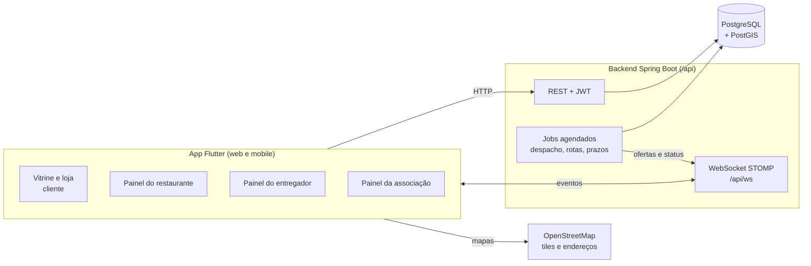
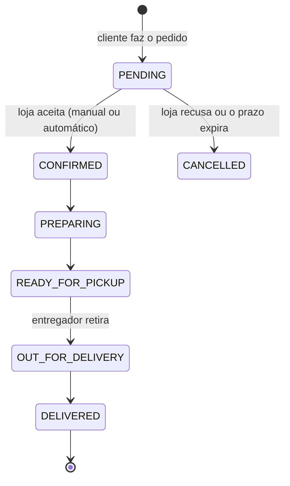
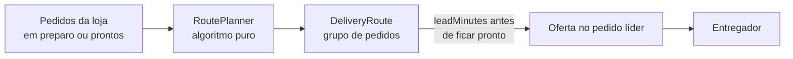

# Arquitetura do OpenBag

> Versão da documentação: **0.2.0**, atualizada em 2026-09-27. O que mudou está no [CHANGELOG](../../CHANGELOG.md).

Este documento explica como o sistema está organizado hoje: módulos do backend, tempo real, despacho de entregas, rotas, caixa e a estrutura do app Flutter. Para rodar o projeto, veja o [guia de desenvolvimento](../../README-DEVELOPER.md).

---

## Visão geral



| Camada | Tecnologia |
|--------|------------|
| App | Flutter 3.16+ (web e mobile), Provider, GoRouter, `flutter_map`, `stomp_dart_client` |
| API | Java 25, Spring Boot 3.3, Spring Security + JWT, Spring Data JPA, SpringDoc |
| Tempo real | WebSocket com STOMP (broker simples do Spring) |
| Banco | PostgreSQL 15 com PostGIS 3 (caminho das rotas) |
| Infra local | Docker Compose: PostgreSQL com PostGIS, Redis, Elasticsearch e Kibana |

Hoje o Redis só tem a configuração e o Elasticsearch não é usado pelo código. Os dois continuam no `docker-compose.yml` para a busca e o cache que virão.

---

## Backend

O código fica em `backend/src/main/java/com/openbag` e é **organizado por módulo de domínio**. Cada módulo tem `controller`, `dto`, `entity`, `repository` e `service`.

```
com/openbag/
├── config/          # Segurança, OpenAPI, Redis, agendamento, dados iniciais
├── security/        # JWT (filtro e provider), UserDetails, PermissionEvaluator
├── enums/           # Status e tipos compartilhados (OrderStatus, CourierPolicy...)
├── exception/       # GlobalExceptionHandler
└── modules/
    ├── user/          # Cadastro, login, perfil, endereços
    ├── restaurant/    # Restaurante, loja (horários, pausa, aparência), página pública
    ├── menu/          # Seções e itens do cardápio do dono
    ├── product/       # Produtos, categorias, complementos, catálogo global
    ├── combo/         # Combos
    ├── order/         # Pedidos do cliente e gestão pela loja, tempo real
    ├── delivery/      # Entregadores, vínculos, despacho, rotas, caixa, ganhos
    ├── organization/  # Associações e cooperativas, membros, convites, tabela
    └── shared/        # Arquivos, health check, utilitários e entidades base
```

### Módulos e rotas principais

Todas as rotas ficam sob o prefixo `/api`. A lista completa está no Swagger: `http://localhost:8080/api/swagger-ui.html`.

| Módulo | Rotas base | O que faz |
|--------|------------|-----------|
| `user` | `/auth`, `/users` | Cadastro (cliente, restaurante, entregador, associação), login JWT, perfil e endereços |
| `restaurant` | `/restaurants`, `/public/restaurants` | Dados da loja, aparência (tema, logo, destaque), endereço, horários, abrir, fechar e pausar; página pública por `slug` |
| `menu` | `/restaurants/{id}/menu` | Seções (com ícone) e itens do cardápio, disponibilidade |
| `product` | `/products`, `/customizations`, `/public/categories`, `/global-products` | Produtos, grupos de complementos, categorias |
| `combo` | `/combos` | Combos da loja |
| `order` | `/orders`, `/restaurants/{id}/orders` | Checkout do cliente e ciclo do pedido na loja (aceitar, preparar, pronto, despachar, entregar) |
| `delivery` | `/me/courier`, `/me/courier/work`, `/public/couriers`, `/restaurants/{id}/delivery`, `/associations/{id}/partnerships`, `/associations/{id}/reports`, `/routes`, `/cash` | Perfil e veículos do entregador, turno e ofertas, configurações de entrega da loja, parcerias entre loja e associação (com tabela especial), relatórios da associação, rotas e caixa |
| `cooperative` | `/associations/{id}/fee-policy`, `/addon-plans`, `/invoices`, `/ledger`, `/finance/summary`, `/benefits`, `/polls`, `/documents`; `/me/association/invoices`, `/addons`, `/solidarity-fund`, `/benefits`, `/polls`, `/documents` | Gestão da associação: cobrança da mensalidade (fixa ou percentual com teto), adicionais, faturas com baixa manual, livro-caixa e caixinha solidária, convênios, enquetes e atas; e a área do cooperado |
| `organization` | `/associations`, `/me/association`, `/public/associations`, `/admin/associations` | Associações: cadastro, aprovação, membros, convites, tabela de entrega e o resumo da associação para o cooperado (`/me/association/report`) |
| `shared` | `/files`, `/health` | Upload e download de arquivos, health check |

### Papéis

`UserType`: `CUSTOMER`, `RESTAURANT_OWNER`, `DELIVERY_PERSON`, `ORGANIZATION` e `ADMIN`. Um mesmo usuário pode ter mais de um painel, e o app mostra um seletor de perfil no menu. As permissões por recurso (por exemplo, "é dono deste restaurante") ficam no `CustomPermissionEvaluator`.

---

## Ciclo do pedido



- **Preço calculado no servidor:** o `OrderCalculator` recalcula itens e complementos, e o valor enviado pelo app não é usado.
- **Código do dia:** cada pedido recebe um `#0001` que reinicia a cada dia.
- **Aceite:** cada loja configura o aceite como `MANUAL` (com prazo, `acceptDeadline`) ou `AUTO`. Um job cancela os pedidos que passam do prazo.
- **Pagamento:** na entrega (`Order.PaymentMethod`: dinheiro com troco, cartão, Pix ou vale-refeição).
- **Horário:** `Restaurant.isOpenNow` usa o fuso `America/Sao_Paulo`.

---

## Tempo real (WebSocket/STOMP)

Endpoint: `/api/ws`. O `StompAuthInterceptor` valida o JWT no `CONNECT` e verifica se o usuário pode assinar cada tópico.

| Tópico | Quem assina | Conteúdo |
|--------|-------------|----------|
| `/topic/restaurants/{id}/orders` | Gestor de pedidos e tela da cozinha | Pedido criado ou alterado |
| `/topic/orders/{id}` | Cliente dono do pedido | Mudanças de status |
| `/topic/couriers/{id}` | O próprio entregador | Ofertas, atribuições, rotas |

Os eventos só saem **depois do commit** da transação (`OrderEventPublisher` e `CourierNotifier`). Assim, ninguém recebe um estado que acabou desfeito.

---

## Despacho de entregas

O despacho fica em `modules/delivery/dispatch`.

### Com quem a loja trabalha

Cada loja escolhe uma política (`CourierPolicy`):

| Política | Significado |
|----------|-------------|
| `OPEN` | Qualquer entregador online perto da loja |
| `PARTNERS_ONLY` | Só entregadores de associações parceiras da loja |
| `FIXED_ONLY` | Só entregadores fixos da loja, com os livres como reserva se a loja quiser (`fallbackToOpen`) |

### Tipos de entregador

- **Livre:** fica online e envia a localização. A oferta vai para quem tem a melhor nota no `CourierSelector`, que combina **distância** e **justiça** (quem ganhou menos no dia tem prioridade). Os pesos ficam em `app.delivery.weight-*`. A oferta expira depois de `offer-timeout-s` (30 s) e passa ao próximo. O raio de busca é `search-radius-km` (6 km).
- **Fixo:** o vínculo com a loja é aprovado pelo dono. O entregador faz check-in a até `checkin-radius-m` (300 m) da loja e, durante o turno, só atende aquela loja.
- **Equipe própria (`StaffCourier`):** entregadores da loja que não usam o app. A loja atribui o pedido diretamente.

### Atribuição direta e troca

A loja pode escolher o entregador sem que ele precise aceitar uma oferta. As regras de troca ficam no `ReassignPolicy`:
- entregador fixo ou da equipe própria: pode ser trocado a qualquer momento antes da retirada;
- entregador livre: só pode ser trocado se não aparecer em `Restaurant.courierNoShowMinutes` (padrão de 10 min) e não estiver a menos de 200 m da loja.

### Valor da entrega

A **tabela da associação** define um valor base até X km e um valor por km extra. O entregador recebe 100% desse valor. O cálculo fica no `DeliveryRateCalculator`.

---

## Rotas



- O `RoutePlanner` é um algoritmo puro, sem banco nem Spring, e por isso é fácil de testar. Ele agrupa pedidos da mesma direção ou bairro quando isso economiza distância.
- O `RoutePlanningService` roda a cada 10 s (`app.delivery.route-planning-ms`) e grava os grupos como `DeliveryRoute`.
- O entregador é chamado `leadMinutes` antes de o último pedido do grupo ficar pronto. Nenhum pedido sai antes de `dispatchReleasedAt`.
- A loja vê e ajusta as rotas em `/restaurante/rotas`: junta, separa e escolhe o entregador.
- O caminho pelas ruas vem do OSRM (`StreetRoutingService`) e fica salvo na rota (`street_path`, uma `LineString` do PostGIS), junto com as paradas usadas no cálculo (`street_path_key`). O painel só pede um caminho novo quando as paradas mudam. Sem resposta do OSRM, o mapa desenha linha reta.

**Duas regras fixas, travadas por testes:**
1. **O ganho do entregador nunca cai por causa da rota.** A oferta de rota paga a soma do valor cheio de cada entrega (teste `routeOfferPaysTheFullTableValueOfEveryDelivery`).
2. **O cliente nunca sabe que o pedido está esperando outro.** Ele recebe `OrderDTO.forCustomer`, sem o tipo de entregador nem os prazos internos, e o histórico usa mensagens neutras.

---

## Caixa

Em `/restaurante/caixa` (`CashReportService` e `CourierSettlement`):
- nas entregas pagas em dinheiro, o dinheiro fica com o entregador;
- o saldo de cada entregador é **dinheiro recebido − ganhos das entregas**;
- a loja registra o acerto, e o acerto fica no histórico.

---

## Jobs agendados

O agendamento é ativado por `@EnableScheduling` no `AppConfig`.

| Job | Intervalo padrão | Propriedade |
|-----|------------------|-------------|
| Expirar pedidos sem aceite | 30 s | `app.orders.expiration-check-ms` |
| Expirar ofertas e passar ao próximo | 5 s | `app.delivery.offer-check-ms` |
| Tentar de novo pedidos sem entregador | 15 s | `app.delivery.retry-ms` |
| Encerrar turnos livres sem sinal | 60 s | `app.delivery.stale-shift-check-ms` |
| Planejar rotas | 10 s | `app.delivery.route-planning-ms` |

> Os jobs rodam em cada instância do backend. Para rodar mais de uma instância, será preciso uma trava distribuída. Isso faz parte da etapa de segurança e integridade (0.4.0).

---

## Dados

- O schema é gerado pelo Hibernate com `spring.jpa.hibernate.ddl-auto=update`. Os arquivos em `db/migration` são antigos e **não são aplicados** (o Flyway não está no `pom.xml`).
- Limitações do `update`:
  - colunas novas em tabelas existentes chegam `NULL`, então use tipos wrapper ou getters com valor padrão;
  - as restrições `CHECK` de enums não são atualizadas, então um valor novo de enum exige ajuste manual.
- A troca por migrações versionadas está no roadmap da versão **0.4.0**.
- O banco precisa do PostGIS: o `schema.sql` cria a extensão antes do Hibernate (`spring.sql.init.mode=always`).

---

## Frontend (Flutter)

```
frontend/lib/
├── main.dart            # Rotas (GoRouter) e providers
├── core/ui/             # Design system: componentes App*, temas e tokens
├── models/              # Modelos por domínio (order, menu, delivery, routes, cash...)
├── services/            # Chamadas à API e ao WebSocket
├── screens/             # Telas por área: restaurant_panel, courier, association...
├── widgets/             # Widgets reutilizáveis por domínio (menu, order, delivery...)
└── utils/               # Formatadores, mapas, localização
```

### Rotas do app

| Rota | Tela | Status |
|------|------|--------|
| `/home` | Vitrine de restaurantes | Em testes |
| `/r/:slug` | Página da loja com o tema dela | Em testes |
| `/cart`, `/checkout` | Carrinho e checkout | Em testes |
| `/pedidos`, `/pedidos/:id` | Meus pedidos e acompanhamento | Em testes |
| `/restaurante/*` | Painel do restaurante (pedidos, cardápio, entregadores, rotas, caixa, avaliações, loja) | Pronto |
| `/restaurante/cozinha` | Tela da cozinha | Pronto |
| `/entregador/*` | Painel do entregador | Em desenvolvimento |
| `/e/:slug` | Perfil público do entregador (placa QR) | Pronto |
| `/associacao/*` | Painel da associação ou cooperativa (membros, convites, lojas parceiras, tabela, relatórios) | Em testes |
| `/admin/associacoes` | Moderação de associações | Pronto |

### Padrões

- **Componentes reutilizáveis:** tudo que se repete vira componente em `core/ui` (prefixo `App*`) ou em `widgets/<domínio>`. Veja o [README do design system](../../frontend/lib/core/ui/README.md) e a vitrine de componentes em `/ui-showcase`.
- **Painéis:** usam o `AppPanelScaffold`, com menu lateral e uma rota por aba (`panelRoutes`). A situação da loja ou do turno aparece no menu.
- **Vitrine do cliente:** usa uma barra superior de vidro (`StorefrontScaffold`). O conteúdo tem no máximo 1200 px de largura.
- **Temas da loja:** 8 presets (`AppThemePreset`) ou a cor da marca. A página da loja aplica o tema com o `RestaurantThemeScope`.
- **Tempo real:** o app assina os tópicos STOMP da tabela acima e atualiza a tela sem recarregar.

As capturas de tela de cada área estão em [`layout/`](../../layout/).

---

## Próximas etapas

O roadmap completo, versão por versão, está no [CHANGELOG](../../CHANGELOG.md#roadmap). Os pontos que afetam a arquitetura são:

- **0.4.0 Segurança e integridade:** travas contra race conditions (`@Version`, restrições no banco), rate limiting, throttling de localização e de WebSocket, idempotência nas ações que mexem com dinheiro e com status, migrações versionadas e trava distribuída para os jobs.
- **0.5.0 Auditoria de dados:** trilha de auditoria com o valor anterior e o novo, histórico que não pode ser alterado para caixa e ganhos, e LGPD.
